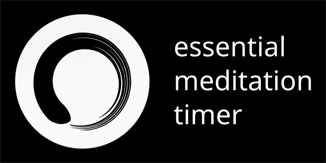

# Meditation

<!--  -->

This is a meditation timer. Minimalistic, reliable, and truly elegant.

     

Or download the APK directly from GitHub:

- **[Latest release](https://github.com/nyxkn/meditation/releases/latest)**

## Features

* Simple, elegant, and intuitive
* No distractions - only the essential features
* Custom volume adjustment
* Reliable countdown timer
* Beautiful assortment of bell and gong sounds
* Intermediate intervals
* Free and open-source software

## Screenshots

&nbsp;

## Description

<i>Meditation</i> is a truly minimalistic countdown timer for meditation, with a clean user interface and no clutter. This is an app that is itself a reflection of meditation's purpose.

Possibly the most important feature of this app is the ability to customize the volume of the notification bells independently of system volume. This allows you to set a predefined volume so that the sounds will reliably play at the same volume every time. No more mid-meditation worrying about whether you remembered to turn the volume up!

Another important feature is for the timer countdown itself to be as reliable as possible, so that there is no doubt the timeout will sound at the right moment and not be delayed.
This is achieved by starting a foreground service and disabling battery optimization (for this last one you'll be asked for the permission).

Reliability is of extreme importance to a meditation tool in order to eliminate all possible worries about the timer not behaving correctly. Just press the button and start!

## Technical notes

An important feature to implement was to have the volume of the notification bells be consistent and reliable.
In other apps, the volume is tied to the system volume, implemented either as using the system volume setting directly, or as a modifier thereof.
Both approaches are flawed and will lead to inconsistent volumes if the system volume changes or if you had forgotten to set it to the desired level before starting the timer.
With my approach the app makes use of a configurable absolute value, so that the sounds play consistently at the same volume no matter what.

Another issue to solve was the reliability of the timer timeout event, making sure it happens at exactly the right time.
For whatever reason, this is a ridiculously complex problem on mobile devices due to the continuous operating system "improvements" to extend battery life that make it really hard to ensure that a time-critical task happens after the right amount of time.
This app will make use of all possible tricks to ensure it is reliable. What I finally found to be working was the combination of these techniques:
- Setting a system alarm with the highest possible priority
- Starting a foreground service to keep the app running
- Disabling battery optimization
- (optional) Keeping the screen on

## Planned features

Things I'm planning to add in the near future:

- ~~Custom time selection~~
- ~~Optionally delay the start of the timer by a few seconds~~
- Custom soundfiles loading
- Dim screen on start

## Credits

### Audio files

Here's a listing of the original audio files that each asset was derived from.
They were all modified to improve cohesion.

- bell_burma: <https://freesound.org/people/LozKaye/sounds/94024/> (CC0)
- bell_indian: <https://soundbible.com/1690-Indian-Bell.html> (CC Sampling Plus 1.0)
- bell_meditation: <https://freesound.org/people/fauxpress/sounds/42095/> (CC0)
- bell_singing: <https://freesound.org/people/ryancacophony/sounds/202017/> (CC0)
- bowl_singing_big: <https://freesound.org/people/Garuda1982/sounds/116315/> (CC0)
- bowl_singing: <https://freesound.org/people/juskiddink/sounds/122647/> (CC-BY 3.0)
- gong_bodhi: <https://github.com/yuttadhammo/BodhiTimer> (origin unclear)
- gong_generated: <https://freesound.org/people/nkuitse/sounds/18654/> (CC0)
- gong_watts: <https://github.com/yuttadhammo/BodhiTimer> (origin unclear; possibly from the "Alan Watts Guided Meditation" audio)

### Other

- [Enso.svg](https://commons.wikimedia.org/wiki/File:Enso.svg) (CC0): used in the making of the app icons.

## License

### Source code

All source code is licensed under the [GPL-3.0-only License](https://spdx.org/licenses/GPL-3.0-only.html).

> This program is [free software](https://www.gnu.org/philosophy/free-sw.html): you can redistribute it and/or modify it under the terms of the [GNU General Public License](https://www.gnu.org/licenses/gpl-3.0.en.html) as published by the Free Software Foundation, version 3.

### Assets

All assets (images and audio files) are licensed under the [CC-BY-SA 4.0 License](https://creativecommons.org/licenses/by-sa/4.0/).

This includes everything in the *assets* and *media* folders and in *android/app/src/main/res*.

### Third-party

This project is developed using the [Flutter framework](https://flutter.dev/), which is licensed under the [BSD 3-Clause License](https://github.com/flutter/flutter/blob/master/LICENSE).

Additional licensing information on all of the Flutter modules that are being used can be found in the in-app *About* screen.
