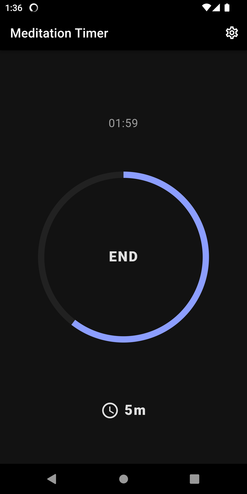
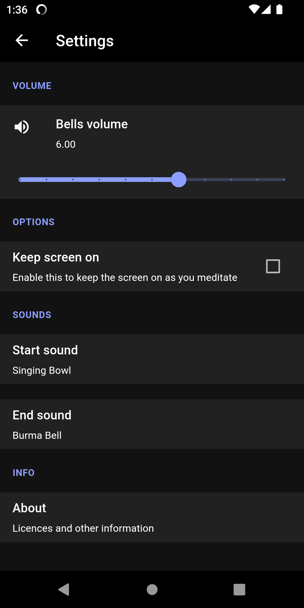

# Meditation

This is a meditation timer. Minimalistic, reliable, and truly elegant.

## Features

- Simple, elegant, and intuitive
- No distractions; only the essential features
- Reliable volume adjustment independent of system volume
- Reliable countdown timer
- Beautiful assortment of bell and gong sounds
- Free and open-source software

## Screenshots

&nbsp;

## About

This project was started with the goal of making a truly minimalistic no-fuss countdown timer for meditation, with a clean UI and no clutter, reflecting the actual purpose of meditation.

Another goal was to have the volume of the notification bells be consistent and reliable.
In other apps, the volume is tied to the system volume, implemented either as using the system volume setting directly, or as a modifier thereof.
Both approaches are flawed and will lead to inconsistent volumes if the system volume changes or if you had forgotten to set it to the desired level before starting the timer.
With my approach the app will use a configurable absolute value, so that the sounds play consistently at the same volume no matter what.
I found that having the reassurance of the sounds being reliable is very important for a worry-free and fiddle-free meditation experience. Just press the start button and go.

Another issue to solve was the reliability of the timer timeout event happening at exactly the right time.
For whatever reason, this is a ridiculously complex problem on mobile devices due to the continuous "improvements" to extend battery life.
This app will make use of all possible tricks to ensure it is reliable. What I finally found to be working was the combination of these techniques:
- Setting a system alarm with the highest possible priority
- Starting a foreground service to keep the app running
- Disabling battery optimization
- (optional) Keep screen on

This might or might not be friendly to battery life.
But I decided that reliability is of extreme importance to a meditation tool in order to eliminate all possible worries about the timer not behaving correctly.

## Credits

### Audio files

Here's a listing of the original audio files that each asset was derived from.
They were all modified to improve cohesion.

- bell_burma: <https://freesound.org/people/LozKaye/sounds/94024/> (CC0)
- bell_indian: <https://soundbible.com/1690-Indian-Bell.html> (CC Sampling Plus 1.0)
- bell_meditation: <https://freesound.org/people/fauxpress/sounds/42095/> (CC0)
- bell_singing: <https://freesound.org/people/ryancacophony/sounds/202017/> (CC0)
- bowl_singing_big: <https://freesound.org/people/Garuda1982/sounds/116315/> (CC0)
- bowl_singing: <https://freesound.org/people/juskiddink/sounds/122647/> (CC-BY 3.0)
- gong_bodhi: <https://github.com/yuttadhammo/BodhiTimer> (origin unclear)
- gong_generated: <https://freesound.org/people/nkuitse/sounds/18654/> (CC0)
- gong_watts: <https://github.com/yuttadhammo/BodhiTimer> (origin unclear; possibly from the "Alan Watts Guided Meditation" audio)

### Other

- [Enso.svg](https://commons.wikimedia.org/wiki/File:Enso.svg) (CC0): used in the making of the app icons.

## License

### Source code

All source code is licensed under the [GPL-3.0-only License](https://spdx.org/licenses/GPL-3.0-only.html).

> This program is [free software](https://www.gnu.org/philosophy/free-sw.html): you can redistribute it and/or modify it under the terms of the [GNU General Public License](https://www.gnu.org/licenses/gpl-3.0.en.html) as published by the Free Software Foundation, version 3.

### Assets

All assets (images and audio files) are licensed under the [CC-BY-SA 4.0 License](https://creativecommons.org/licenses/by-sa/4.0/).

This includes everything in the *assets* folder and in *android/app/src/main/res*.

### Third-party

This project is developed using the [Flutter framework](https://flutter.dev/), which is licensed under the [BSD 3-Clause License](https://github.com/flutter/flutter/blob/master/LICENSE).

Additional licensing information on all of the Flutter modules that are being used can be found in the in-app *About* screen.
